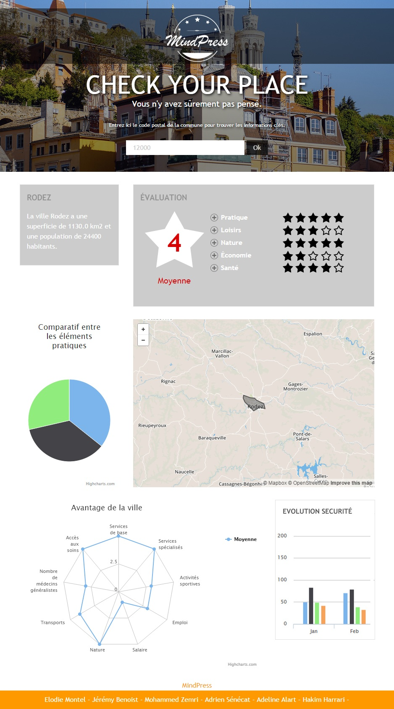

#Check Your Place

This app aim to present what you didn't think when you are looking for a new place to live. We check commerce proximity, security, life quality, etc .. to generate a note (between 0 and 5) for your city.

## Context

During a Hackday at [LExpress](http://www.lexpress.fr) we were 3 teams fighting each other to build a project around opendata.

We got one day

 - to find the idea
 - find the data
 - build the project
 - make a short 10 minutes presentation

The tag `v1.0` is where the project was by the end of the hackday. We then took few minutes to fix annoying bugs.

## Screenshot



## How to install and play with it

```
composer install
php symfony doctrine:build --all
# insert 36k+ postal code
php symfony init:postal-code
# insert 3k data from insee
php symfony init:insee-data
# insert 36k+ security data (some 'notfound' log should appear)
# this one eat a lot of memory 400M+ at the end
php symfony init:securite-data
php symfony project:permissions
```

## Open data used

- https://www.data.gouv.fr/fr/datasets/les-crimes-et-delits-enregistres-par-la-gendarmerie-nationa-0/
- http://public.opendatasoft.com/explore/dataset/correspondance-code-insee-code-postal/?tab=metas
- https://www.data.gouv.fr/fr/datasets/une-approche-de-la-qualite-de-vie-dans-les-territoires/

## Results

Sadly, we lost the hackday :(
